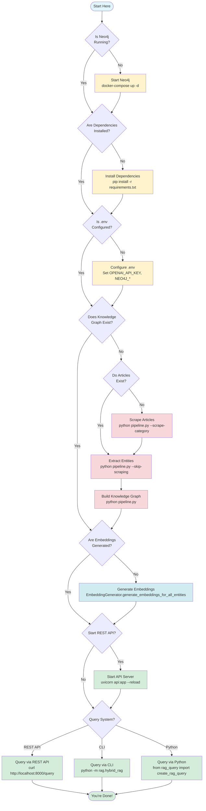

# How to Run Everything - Complete Guide

This guide walks you through running the entire TechCrunch Knowledge Graph Pipeline and GraphRAG system from scratch to production.

---

## 📋 Table of Contents

1. [Decision Flow Diagram](#decision-flow-diagram)
2. [Prerequisites](#prerequisites)
3. [Initial Setup](#initial-setup)
4. [Step 1: Start Neo4j](#step-1-start-neo4j)
5. [Step 2: Install Dependencies](#step-2-install-dependencies)
6. [Step 3: Configure Environment](#step-3-configure-environment)
7. [Step 4: Build the Knowledge Graph](#step-4-build-the-knowledge-graph)
8. [Step 5: Start the REST API](#step-5-start-the-rest-api)
9. [Step 6: Query the System](#step-6-query-the-system)
10. [Troubleshooting](#troubleshooting)
11. [Quick Reference](#quick-reference)

---

## Decision Flow Diagram

Use this diagram to determine which steps you need to run based on your current situation:



### Quick Decision Guide

**If you're starting from scratch:**
1. Start Neo4j → Install Dependencies → Configure .env
2. Scrape Articles → Extract Entities → Build Graph
3. Generate Embeddings
4. Start REST API → Query System

**If you already have articles:**
1. Start Neo4j → Install Dependencies → Configure .env
2. Extract Entities → Build Graph (skip scraping)
3. Generate Embeddings
4. Start REST API → Query System

**If you already have a graph:**
1. Verify Neo4j is running
2. Generate Embeddings (if not done)
3. Start REST API → Query System

**If you just want to query:**
1. Verify Neo4j is running
2. Start REST API → Query System

### Alternative: Text-Based Flow Diagram

If Mermaid diagrams don't render in your viewer, here's a text-based version:

```
START
  │
  ├─ Is Neo4j Running?
  │   ├─ No → Start Neo4j (docker-compose up -d)
  │   └─ Yes → Continue
  │
  ├─ Are Dependencies Installed?
  │   ├─ No → Install (pip install -r requirements.txt)
  │   └─ Yes → Continue
  │
  ├─ Is .env Configured?
  │   ├─ No → Configure .env (OPENAI_API_KEY, NEO4J_*)
  │   └─ Yes → Continue
  │
  ├─ Does Knowledge Graph Exist?
  │   ├─ No → Check Articles
  │   │   ├─ No Articles → Scrape Articles
  │   │   └─ Yes Articles → Extract Entities
  │   │       └─ Build Graph
  │   └─ Yes → Continue
  │
  ├─ Are Embeddings Generated?
  │   ├─ No → Generate Embeddings
  │   └─ Yes → Continue
  │
  ├─ Start REST API?
  │   ├─ Yes → Start API Server (uvicorn api:app --reload)
  │   └─ No → Skip
  │
  ├─ Query System?
  │   ├─ REST API → curl http://localhost:8000/query
  │   ├─ CLI → python -m rag.hybrid_rag
  │   └─ Python → from rag_query import create_rag_query
  │
  └─ DONE
```

---

## Prerequisites

Before starting, ensure you have:

- **Python 3.11+** installed
- **Docker** (for Neo4j) or Neo4j Desktop installed
- **OpenAI API Key** (for entity extraction and LLM generation)
- **Git** (to clone the repository)

---

## Initial Setup

### Clone/Navigate to Project

```bash
# If you haven't already, navigate to the project directory
cd "/Users/hasheerama/SWM Project"
```

---

## Step 1: Start Neo4j

### Option A: Using Docker (Recommended)

```bash
# Start Neo4j using docker-compose
docker-compose up -d

# Or manually with Docker
docker run -d \
  --name neo4j \
  -p 7474:7474 \
  -p 7687:7687 \
  -e NEO4J_AUTH=neo4j/password \
  neo4j:latest

# Verify Neo4j is running
docker ps | grep neo4j
```

### Option B: Using Neo4j Desktop

1. Download and install Neo4j Desktop from https://neo4j.com/download/
2. Create a new database
3. Start the database
4. Note the connection URI (usually `bolt://localhost:7687`)

### Verify Neo4j Connection

```bash
# Test connection
python -c "
from neo4j import GraphDatabase
driver = GraphDatabase.driver('bolt://localhost:7687', auth=('neo4j', 'password'))
driver.verify_connectivity()
print('✅ Neo4j connected!')
driver.close()
"
```

**Access Neo4j Browser:** http://localhost:7474
- Username: `neo4j`
- Password: `password` (or your configured password)

---

## Step 2: Install Dependencies

```bash
# Create virtual environment (recommended)
python -m venv .venv

# Activate virtual environment
# On macOS/Linux:
source .venv/bin/activate
# On Windows:
# .venv\Scripts\activate

# Install all dependencies
pip install -r requirements.txt --break-system-packages

# If using sentence-transformers, it will download models on first use
```

**Important:** If you encounter issues with `--break-system-packages`, try:
```bash
pip install -r requirements.txt
```

---

## Step 3: Configure Environment

Create a `.env` file in the project root:

```bash
# Create .env file
cat > .env << 'EOF'
# OpenAI API (Required for entity extraction and LLM generation)
OPENAI_API_KEY=sk-your-openai-api-key-here

# Neo4j Connection (Required)
NEO4J_URI=bolt://localhost:7687
NEO4J_USER=neo4j
NEO4J_PASSWORD=password

# Optional: API Configuration
API_HOST=0.0.0.0
API_PORT=8000

# Optional: Embedding Backend
RAG_EMBEDDING_BACKEND=openai  # or "sentence-transformers"
SENTENCE_TRANSFORMERS_MODEL=BAAI/bge-small-en-v1.5

# Optional: Verbose Logging
RAG_VERBOSE=1
EOF
```

**Replace the placeholder values:**
- `OPENAI_API_KEY`: Your actual OpenAI API key
- `NEO4J_PASSWORD`: Your Neo4j password (if different from `password`)

---

## Step 4: Build the Knowledge Graph

### Option A: Full Pipeline (Scraping + Extraction + Graph Building)

```bash
# Run complete pipeline with scraping
python pipeline.py \
  --scrape-category startups \
  --scrape-max-pages 2 \
  --max-articles 10

# This will:
# 1. Scrape TechCrunch articles
# 2. Extract entities and relationships using GPT-4o
# 3. Build Neo4j knowledge graph
# 4. Run post-processing (deduplication, validation, etc.)
```

### Option B: Use Existing Articles (Skip Scraping)

If you already have articles in `data/articles/`:

```bash
# Extract entities and build graph from existing articles
python pipeline.py \
  --skip-scraping \
  --max-articles 50

# Or build graph from existing extractions
python pipeline.py \
  --skip-scraping \
  --skip-extraction
```

### Option C: Production Build (Large Dataset)

```bash
# Process all articles from a category
python pipeline.py \
  --scrape-category ai \
  --scrape-max-pages 10

# This may take several hours depending on the number of articles
```

### Generate Embeddings (Required for Semantic Search)

```bash
# Generate embeddings for all entities
python -c "
from neo4j import GraphDatabase
from utils.embedding_generator import EmbeddingGenerator

driver = GraphDatabase.driver('bolt://localhost:7687', auth=('neo4j', 'password'))
generator = EmbeddingGenerator(driver, embedding_model='openai')
stats = generator.generate_embeddings_for_all_entities()
print(f'Generated {stats[\"generated\"]} embeddings')
driver.close()
"
```

**Or use sentence-transformers:**
```bash
python -c "
from neo4j import GraphDatabase
from utils.embedding_generator import EmbeddingGenerator

driver = GraphDatabase.driver('bolt://localhost:7687', auth=('neo4j', 'password'))
generator = EmbeddingGenerator(driver, embedding_model='sentence_transformers')
stats = generator.generate_embeddings_for_all_entities()
print(f'Generated {stats[\"generated\"]} embeddings')
driver.close()
"
```

### Verify Graph is Built

```bash
# Check graph statistics
python -c "
from neo4j import GraphDatabase

driver = GraphDatabase.driver('bolt://localhost:7687', auth=('neo4j', 'password'))
with driver.session() as session:
    result = session.run('MATCH (n) RETURN count(n) as count')
    count = result.single()['count']
    print(f'Total nodes: {count}')
    
    result = session.run('MATCH ()-[r]->() RETURN count(r) as count')
    count = result.single()['count']
    print(f'Total relationships: {count}')
driver.close()
"
```

---

## Step 5: Start the REST API

### Start the API Server

```bash
# Option 1: Using uvicorn directly
uvicorn api:app --reload --host 0.0.0.0 --port 8000

# Option 2: Using the API script (if it has a main block)
python api.py

# Option 3: Run in background
nohup uvicorn api:app --host 0.0.0.0 --port 8000 > api.log 2>&1 &
```

You should see:
```
🚀 Starting GraphRAG API...
✅ GraphRAG instance initialized
INFO:     Started server process
INFO:     Waiting for application startup.
INFO:     Application startup complete.
INFO:     Uvicorn running on http://0.0.0.0:8000
```

### Access API Documentation

- **Swagger UI**: http://localhost:8000/docs
- **ReDoc**: http://localhost:8000/redoc
- **Health Check**: http://localhost:8000/health

---

## Step 6: Query the System

### Option A: Using the REST API

#### Test with cURL

```bash
# Health check
curl http://localhost:8000/health

# Ask a question
curl -X POST "http://localhost:8000/query" \
  -H "Content-Type: application/json" \
  -d '{
    "question": "Which AI startups raised funding recently?",
    "return_context": false,
    "use_llm": true
  }'

# Semantic search
curl -X POST "http://localhost:8000/search/semantic" \
  -H "Content-Type: application/json" \
  -d '{
    "query": "artificial intelligence",
    "top_k": 10
  }'

# Get company profile
curl http://localhost:8000/company/OpenAI

# Compare entities
curl -X POST "http://localhost:8000/entity/compare" \
  -H "Content-Type: application/json" \
  -d '{
    "entity1": "OpenAI",
    "entity2": "Anthropic"
  }'
```

#### Test with Python Client

```bash
# Run the example client
python api_client_example.py
```

#### Test with Python Requests

```python
import requests

# Query the knowledge graph
response = requests.post(
    "http://localhost:8000/query",
    json={
        "question": "Tell me about OpenAI",
        "return_context": False,
        "use_llm": True
    }
)

result = response.json()
print(result["answer"])
print(result["intent"])
```

### Option B: Using Hybrid RAG (CLI)

```bash
# Basic query
python -m rag.hybrid_rag "Tell me about OpenAI and Sam Altman" \
  --entities 5 --docs 5 --hops 1 --verbose

# Using sentence-transformers (no OpenAI API needed for embeddings)
python -m rag.hybrid_rag "Your question" \
  --embedding-backend sentence-transformers \
  --st-model BAAI/bge-small-en-v1.5 \
  --entities 5 --docs 5 --hops 1

# Via convenience script
python scripts/hybrid_rag_cli.py "Your question" --entities 5 --docs 5
```

### Option C: Using GraphRAG Query System (Python)

```python
from rag_query import create_rag_query

# Initialize GraphRAG
rag = create_rag_query()

# Query the knowledge graph
result = rag.query(
    "Which AI startups raised funding recently?",
    return_context=True,
    use_llm=True
)

print(result["answer"])
print(result["intent"])

# Semantic search
entities = rag.semantic_search("AI startup", top_k=10)
print(entities)

# Get entity details
entity = rag.get_entity_by_name("OpenAI")
print(entity)

# Compare entities
comparison = rag.compare_entities("OpenAI", "Anthropic")
print(comparison)

# Close connection
rag.close()
```

### Option D: Using Neo4j Browser

1. Open http://localhost:7474
2. Login with username: `neo4j`, password: `password`
3. Run Cypher queries:

```cypher
// Get statistics
MATCH (n)
RETURN labels(n)[0] as type, count(n) as count
ORDER BY count DESC;

// Find most connected companies
MATCH (c:Company)-[r]-()
RETURN c.name, count(r) as connections
ORDER BY connections DESC
LIMIT 10;

// Find funding relationships
MATCH (c:Company)-[r:FUNDED_BY]->(i:Investor)
RETURN c.name as company, i.name as investor, r.strength as strength
ORDER BY r.strength DESC
LIMIT 20;
```

---

## Troubleshooting

### Issue: Neo4j Connection Failed

```bash
# Check if Neo4j is running
docker ps | grep neo4j

# Restart Neo4j
docker-compose restart

# Or restart manually
docker restart neo4j
```

### Issue: OpenAI API Key Error

```bash
# Check .env file
cat .env | grep OPENAI_API_KEY

# Test API key
python -c "
import os
from dotenv import load_dotenv
from openai import OpenAI

load_dotenv()
client = OpenAI(api_key=os.getenv('OPENAI_API_KEY'))
print('✅ OpenAI API key is valid')
"
```

### Issue: Missing Dependencies

```bash
# Reinstall dependencies
pip install -r requirements.txt --break-system-packages --upgrade

# Install specific missing package
pip install fastapi uvicorn neo4j openai sentence-transformers
```

### Issue: API Server Won't Start

```bash
# Check if port 8000 is in use
lsof -i :8000

# Use a different port
uvicorn api:app --reload --host 0.0.0.0 --port 8001
```

### Issue: No Embeddings Found

```bash
# Generate embeddings for all entities
python -c "
from neo4j import GraphDatabase
from utils.embedding_generator import EmbeddingGenerator

driver = GraphDatabase.driver('bolt://localhost:7687', auth=('neo4j', 'password'))
generator = EmbeddingGenerator(driver, embedding_model='openai')
stats = generator.generate_embeddings_for_all_entities()
print(f'Generated {stats[\"generated\"]} embeddings')
driver.close()
"
```

### Issue: Graph is Empty

```bash
# Check if articles exist
ls -la data/articles/

# Run pipeline to build graph
python pipeline.py --skip-scraping --max-articles 10
```

---

## Quick Reference

### Common Commands

```bash
# Start Neo4j
docker-compose up -d

# Build knowledge graph
python pipeline.py --scrape-category startups --scrape-max-pages 2 --max-articles 10

# Generate embeddings
python -c "from neo4j import GraphDatabase; from utils.embedding_generator import EmbeddingGenerator; driver = GraphDatabase.driver('bolt://localhost:7687', auth=('neo4j', 'password')); generator = EmbeddingGenerator(driver, embedding_model='openai'); generator.generate_embeddings_for_all_entities(); driver.close()"

# Start REST API
uvicorn api:app --reload --host 0.0.0.0 --port 8000

# Query via CLI
python -m rag.hybrid_rag "Your question" --entities 5 --docs 5 --hops 1

# Test API
curl http://localhost:8000/health
```

### Environment Variables

```bash
# Required
OPENAI_API_KEY=sk-...
NEO4J_URI=bolt://localhost:7687
NEO4J_USER=neo4j
NEO4J_PASSWORD=password

# Optional
API_HOST=0.0.0.0
API_PORT=8000
RAG_EMBEDDING_BACKEND=openai
SENTENCE_TRANSFORMERS_MODEL=BAAI/bge-small-en-v1.5
RAG_VERBOSE=1
```

### Important URLs

- **Neo4j Browser**: http://localhost:7474
- **API Docs (Swagger)**: http://localhost:8000/docs
- **API Docs (ReDoc)**: http://localhost:8000/redoc
- **Health Check**: http://localhost:8000/health

---

## Complete Workflow Example

Here's a complete example from scratch:

```bash
# 1. Start Neo4j
docker-compose up -d

# 2. Install dependencies
pip install -r requirements.txt --break-system-packages

# 3. Create .env file (edit with your keys)
cat > .env << 'EOF'
OPENAI_API_KEY=sk-your-key
NEO4J_URI=bolt://localhost:7687
NEO4J_USER=neo4j
NEO4J_PASSWORD=password
EOF

# 4. Build knowledge graph (small test)
python pipeline.py \
  --scrape-category startups \
  --scrape-max-pages 1 \
  --max-articles 5

# 5. Generate embeddings
python -c "
from neo4j import GraphDatabase
from utils.embedding_generator import EmbeddingGenerator
driver = GraphDatabase.driver('bolt://localhost:7687', auth=('neo4j', 'password'))
generator = EmbeddingGenerator(driver, embedding_model='openai')
generator.generate_embeddings_for_all_entities()
driver.close()
"

# 6. Start REST API
uvicorn api:app --reload --host 0.0.0.0 --port 8000

# 7. In another terminal, test the API
curl -X POST "http://localhost:8000/query" \
  -H "Content-Type: application/json" \
  -d '{"question": "What AI startups exist?", "use_llm": true}'
```

---

## Next Steps

- Explore the **API documentation** at http://localhost:8000/docs
- Try the **example client**: `python api_client_example.py`
- Read **RAG_DOCUMENTATION.md** for advanced features
- Check **GETTING_STARTED.md** for more detailed setup
- Review **IMPROVEMENTS_AND_RECOMMENDATIONS.md** for optimization tips

---

**Happy querying! 🚀**

